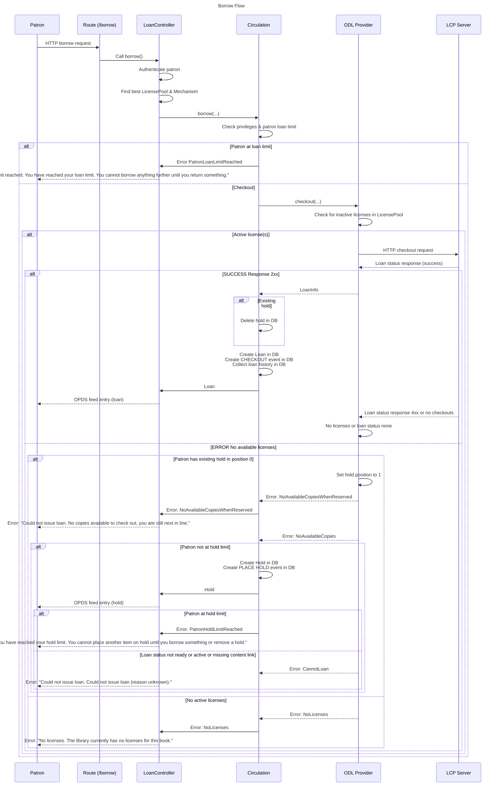

```mermaid
sequenceDiagram
title Borrow Flow
    participant Patron
    participant FlaskRoute as Route (/borrow)
    participant LoanController
    participant CirculationAPI as Circulation
    participant ODLAPI as ODL Provider
    participant ODLServer as LCP Server

    Patron->>FlaskRoute: HTTP borrow request
    FlaskRoute->>LoanController: Call borrow()
    LoanController->>LoanController: Authenticate patron
    LoanController->>LoanController: Find best LicensePool & Mechanism
    LoanController->>CirculationAPI: borrow(...)
    CirculationAPI->>CirculationAPI: Check privileges & patron loan limit
    alt Patron at loan limit
        CirculationAPI->>LoanController: Error PatronLoanLimitReached
        LoanController-->>Patron: Error: "Loan limit reached. You have reached your loan limit. You cannot borrow anything further until you return something."
    else Checkout
        CirculationAPI->>ODLAPI: checkout(...)
        ODLAPI->>ODLAPI: Check for inactive licenses in LicensePool
        alt Active license(s)
            ODLAPI->>ODLServer: HTTP checkout request
            ODLServer-->>ODLAPI: Loan status response (success)
            alt SUCCESS Response 2xx
                ODLAPI-->>CirculationAPI: LoanInfo
                alt Existing hold
                    CirculationAPI->>CirculationAPI: Delete hold in DB
                end
                CirculationAPI->>CirculationAPI: Create Loan in DB<br/>Create CHECKOUT event in DB<br/>Collect loan history in DB
                CirculationAPI->>LoanController: Loan
                LoanController-->>Patron: OPDS feed entry (loan)
            ODLServer-->>ODLAPI: Loan status response 4xx or no checkouts
            ODLAPI ->> ODLAPI: No licenses or loan status none
            else ERROR No available licenses
                alt Patron has existing hold in position 0
                    ODLAPI->>ODLAPI: Set hold position to 1
                    ODLAPI-->>CirculationAPI: Error: NoAvailableCopiesWhenReserved
                    CirculationAPI->>LoanController: Error: NoAvailableCopiesWhenReserved
                    LoanController-->>Patron: Error: "Could not issue loan. No copies available to check out, you are still next in line."
                ODLAPI-->>CirculationAPI: Error: NoAvailableCopies
                alt Patron not at hold limit
                    CirculationAPI->>CirculationAPI: Create Hold in DB<br/>Create PLACE HOLD event in DB
                    CirculationAPI->>LoanController: Hold
                    LoanController-->>Patron: OPDS feed entry (hold)
                alt Patron at hold limit
                    CirculationAPI->>LoanController: Error: PatronHoldLimitReached
                    LoanController-->>Patron: Error: "Limit reached. You have reached your hold limit. You cannot place another item on hold until you borrow something or remove a hold."
                else Loan status not ready or active or missing content link
                    ODLAPI-->>CirculationAPI: Error: CannotLoan
                    LoanController-->>Patron: Error: "Could not issue loan. Could not issue loan (reason unknown)."
                end
            end
        else No active licenses
            ODLAPI-->>CirculationAPI: Error: NoLicenses
                CirculationAPI->>LoanController: Error: NoLicenses
                LoanController-->>Patron: Error: "No licenses. The library currently has no licenses for this book."
            end 
        end
    end
end
```