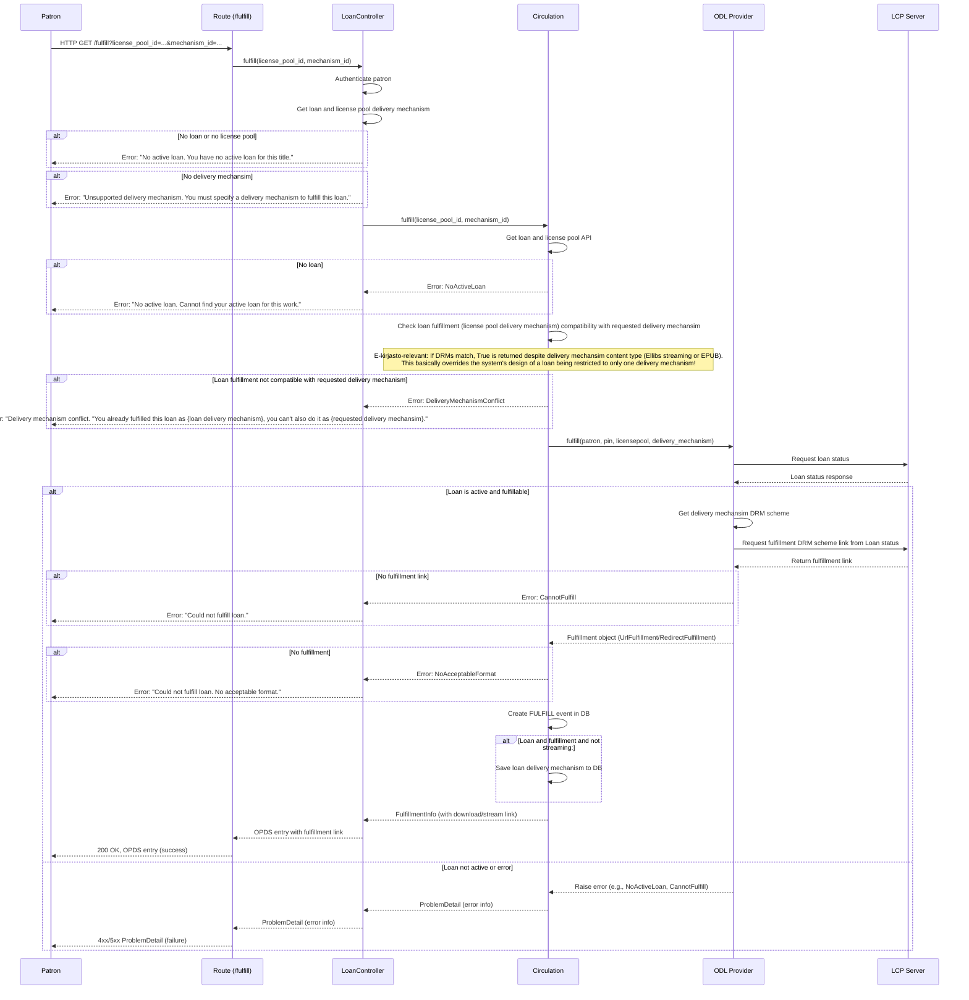

```mermaid
%% Mermaid Sequence Diagram: Fulfill Request (LCP, EPUB/PDF/Audiobook)
%% Flow: Route → LoanController → CirculationAPI → ODL → ODL Server

sequenceDiagram
    participant Patron
    participant FlaskRoute as Route (/fulfill)
    participant LoanController
    participant CirculationAPI as Circulation
    participant ODLAPI as ODL Provider
    participant ODLServer as LCP Server

    Patron->>FlaskRoute: HTTP GET /fulfill?license_pool_id=...&mechanism_id=...
    FlaskRoute->>LoanController: fulfill(license_pool_id, mechanism_id)
    LoanController->>LoanController: Authenticate patron
    LoanController->>LoanController: Get loan and license pool delivery mechanism
    alt No loan or no license pool
        LoanController-->>Patron: Error: "No active loan. You have no active loan for this title."
    end
    alt No delivery mechansim
        LoanController-->>Patron: Error: "Unsupported delivery mechanism. You must specify a delivery mechanism to fulfill this loan."
    end
    LoanController->>CirculationAPI: fulfill(license_pool_id, mechanism_id)
    CirculationAPI->>CirculationAPI: Get loan and license pool API
    alt No loan
        CirculationAPI-->>LoanController: Error: NoActiveLoan
        LoanController-->>Patron: Error: "No active loan. Cannot find your active loan for this work."
    end
    CirculationAPI->>CirculationAPI: Check loan fulfillment (license pool delivery mechanism) compatibility with requested delivery mechansim
    Note over CirculationAPI: E-kirjasto-relevant: If DRMs match, True is returned despite delivery mechansim content type (Ellibs streaming or EPUB).<br/>This basically overrides the system's design of a loan being restricted to only one delivery mechanism!
    alt Loan fulfillment not compatible with requested delivery mechanism
        CirculationAPI-->>LoanController: Error: DeliveryMechanismConflict
        LoanController-->>Patron: Error: "Delivery mechanism conflict. "You already fulfilled this loan as {loan delivery mechanism}, you can't also do it as {requested delivery mechansim}."
    end
    CirculationAPI->>ODLAPI: fulfill(patron, pin, licensepool, delivery_mechanism)
    ODLAPI->>ODLServer: Request loan status
    ODLServer-->>ODLAPI: Loan status response
    alt Loan is active and fulfillable
        ODLAPI->>ODLAPI: Get delivery mechansim DRM scheme
        ODLAPI->>ODLServer: Request fulfillment DRM scheme link from Loan status
        ODLServer-->>ODLAPI: Return fulfillment link
        alt No fulfillment link
            ODLAPI-->>LoanController: Error: CannotFulfill
            LoanController-->>Patron: Error: "Could not fulfill loan."
        end
        ODLAPI-->>CirculationAPI: Fulfillment object (UrlFulfillment/RedirectFulfillment)
        alt No fulfillment
            CirculationAPI-->>LoanController: Error: NoAcceptableFormat
            LoanController-->>Patron: Error: "Could not fulfill loan. No acceptable format."
        end
        CirculationAPI->>CirculationAPI: Create FULFILL event in DB
        alt Loan and fulfillment and not streaming:
            CirculationAPI->>CirculationAPI: Save loan delivery mechanism to DB
        end
        CirculationAPI-->>LoanController: FulfillmentInfo (with download/stream link)
        LoanController-->>FlaskRoute: OPDS entry with fulfillment link
        FlaskRoute-->>Patron: 200 OK, OPDS entry (success)
    else Loan not active or error
        ODLAPI-->>CirculationAPI: Raise error (e.g., NoActiveLoan, CannotFulfill)
        CirculationAPI-->>LoanController: ProblemDetail (error info)
        LoanController-->>FlaskRoute: ProblemDetail (error info)
        FlaskRoute-->>Patron: 4xx/5xx ProblemDetail (failure)
    end
```